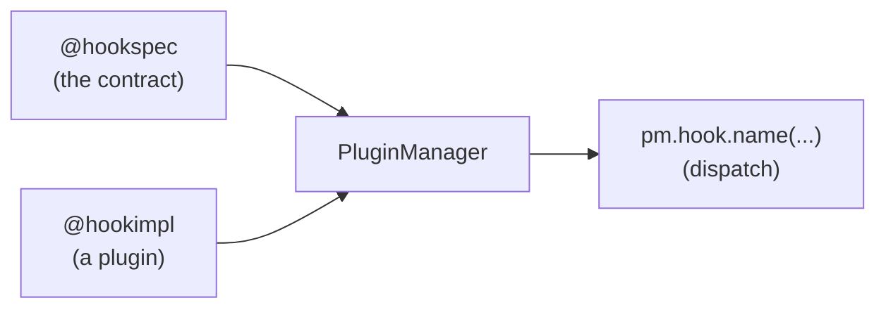

# Overview

A plugin system lets a **host** application be extended by code it has never seen.
pluginkit, like pluggy, does this with three moving parts.



## 1. Hook specifications

The host declares **what** can be extended by writing hook specifications -
ordinary functions decorated with `@hookspec`. A spec is just a name and a
signature; its body is never executed. It is the contract a plugin agrees to.

```python
@hookspec
def add_ingredients(base: list[str]) -> list[str]:
    """Offer ingredients to add to the smoothie."""
```

## 2. Hook implementations

A plugin provides **how** by writing hook implementations - functions or methods
decorated with `@hookimpl` whose name matches a spec (or uses `specname=` to point
at one).

```python
class BerryPlugin:
    @hookimpl
    def add_ingredients(self, base: list[str]) -> list[str]:
        return ["blueberry", "strawberry"]
```

## 3. The plugin manager

The [`PluginManager`](plugin-manager.md) ties them together. It learns the specs
(`add_hookspecs`), accepts plugins (`register`, or `load_entrypoints` for external
ones), and exposes each hook as a callable on `pm.hook`. Calling the hook invokes
every registered implementation and collects the results.

```python
pm = PluginManager("kitchen")
pm.add_hookspecs(specs_module)
pm.register(BerryPlugin())
results = pm.hook.add_ingredients(base=["banana"])
```

## The project name

Every marker and manager is bound to a **project name** (here, `"kitchen"`). The
name namespaces the attribute the markers stamp onto functions, so two plugin
systems in the same process never collide. A plugin's `@hookimpl` marker must use
the same project name as the host's `PluginManager`.

## What makes it a *framework*, not a registry

A plain callback registry calls one function. The value here is the dispatch
policy layered on top:

- **collecting vs first-result** - gather every result, or stop at the first.
- **ordering** - `tryfirst` / `trylast` to influence call order.
- **wrappers** - decorate the whole call, observe results and exceptions.
- **historic replay** - deliver a past call to plugins that load later.
- **discovery** - find plugins shipped as independent packages.

Each of these has its own [mechanism page](../mechanisms/direct.md).
