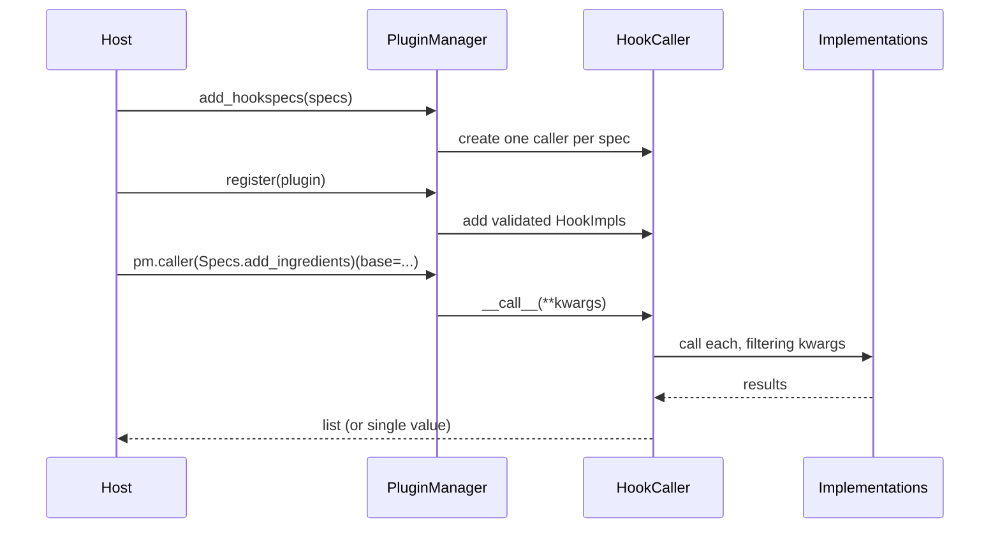

# The plugin manager

`PluginManager` is the run-time hub. Source:
[`pluginkit/manager.py`](../api-reference.md#manager).

## Lifecycle of a call



## Adding specs

`add_hookspecs(namespace)` scans a module or object for functions carrying the
project's spec attribute and creates one `HookCaller` per spec. It also records
each spec's argument names, which are used later to validate implementations.

```python
pm = PluginManager("kitchen")
pm.add_hookspecs(hookspecs)   # a module is fine
```

## Registering plugins

`register(plugin, name=None)` discovers the plugin's implementations, validates
each one, then wires them into the matching callers. The plugin may be a class
instance or a module; implementations may be methods or module-level functions.

Registration is validated up front and fails loudly:

- an implementation for an unknown hook raises `PluginValidationError`
  (unless it is marked `optionalhook`);
- an implementation that declares an argument the spec does not have raises
  `PluginValidationError` - this catches typos that would otherwise silently
  never receive their value;
- a duplicate plugin name, or the same plugin object twice, raises `ValueError`.

## Looking plugins up and removing them

The manager tracks names to plugin objects, so the usual lifecycle operations are
available:

```python
pm.is_registered(plugin)   # bool
pm.get_plugin("berry")     # object | None
pm.get_name(plugin)        # str | None
pm.plugin_names()          # ['berry', 'greens']
pm.unregister("berry")     # remove it and all its impls
```

## Blocking

`set_blocked(name)` unregisters a plugin if present and refuses any future
registration under that name - useful to keep a known-bad or superseded plugin
out, including ones that would otherwise arrive via entry-point discovery.

```python
pm.set_blocked("greens")
pm.is_blocked("greens")    # True
```

## Thread safety

Registry mutations - `register`, `unregister`, `set_blocked`, `add_hookspecs` -
are guarded by a re-entrant lock, so plugins can be loaded from multiple threads.
Hook **calls** are deliberately not locked: locking every dispatch would serialise
the whole application. Coordinate calls yourself if they can race with
registration.

## Calling a hook

`pm.caller(spec)` is the typed entry point: it returns a caller whose result type is
derived from the spec's dispatch mode (`list[R]` for collecting, `R | None` for
firstresult, `R` for pipeline), checked by mypy and pyright.

```python
results = pm.caller(Specs.add_ingredients)(base=["banana"])   # typed list[list[str]]
```

## The hook relay

`pm.hook` is a `HookRelay` - the untyped shorthand. Attribute access resolves to the
`HookCaller` for that hook name via `__getattr__`, which is what makes
`pm.hook.add_ingredients(...)` read so naturally; it returns `Any`. An unknown name
raises `AttributeError`. `pm.caller(spec)` resolves to the same `HookCaller`, so the
two share one manager - use `pm.caller` when you want the type checker's help.
